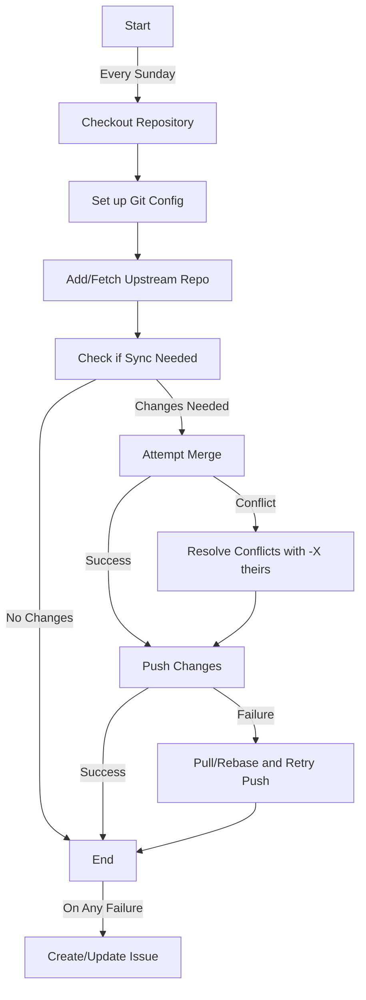

# Sync with Upstream Workflow Documentation

This workflow automatically synchronizes our fork with it's upstream repository at periodic intervals.

## Details

Default config:

- **File**: `.github/workflows/sync.yml`
- **Schedule**: Runs weekly {Sundays at midnight (UTC)}
- **Manual Trigger**: Also supported
- **Target Branch**: `main`
- **Upstream Repository**: `https://github.com/KhronosGroup/glslang.git`

## Customization

#### Sync Schedule

Via cron:

- '0 0 * * *'  # Run every day at midnight
- '0 0 * * 0'  # Run every Sunday at midnight
- '0 0 1-7 * 0' # Run on the first Sunday of every month
...

#### Sync Branch and Repo

Via evironment variables:

- `SYNC_BRANCH`: Target branch for synchronization
- `UPSTREAM_REPO`: URL of the upstream repository

## Process

#### ⚠️ May overwrite modified files on merge conflict due to conflict resolution strategy, which prefers upstream changes, keep in mind while using.

## Troubleshooting

If sync fails, the workflow will:
1. Create an issue with label `sync` and `bot`
2. Include failure details and workflow log link
3. Update existing issue if one already exists with a comment

***P.S.*** **Check the workflow logs for more details.**
_The latest commit SHA of the local and upstream branch along with the outputs of git status and git diff on merge is logged._
